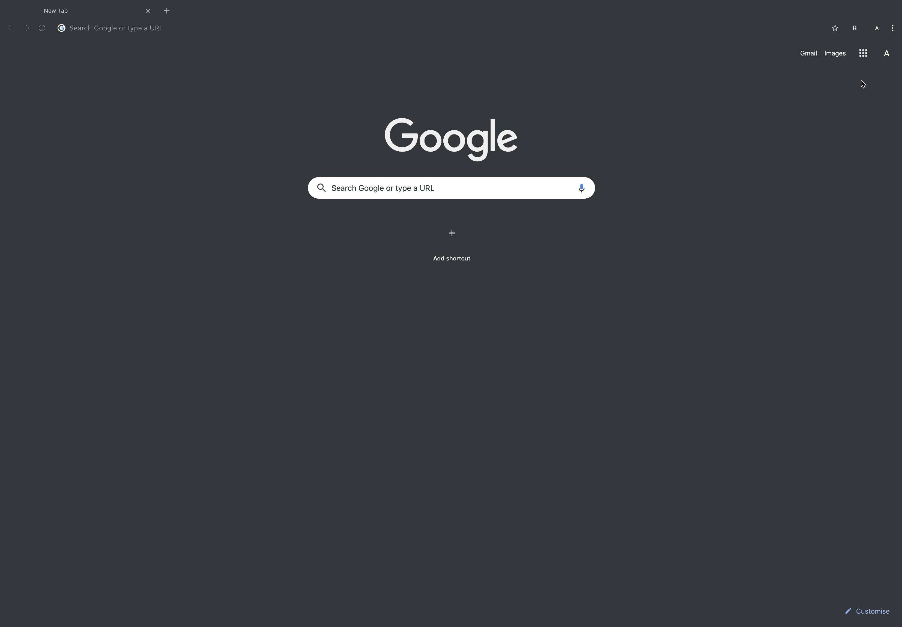

[](https://travis-ci.com/arsalanc-v2/clear)
[](https://github.com/prettier/prettier)
[](https://deepscan.io/dashboard#view=project&tid=4974&pid=6771&bid=58345)

# clear
> Buttonifies the removal of all of one's Google searches stored by Google, as a Chrome extension for convenience.



## Performance
Takes < 2 seconds.

## Behaviour
* Returns to the tab that was active prior to clicking
* Displays an alert box at the end indicating whether the deletion was successful or not
* Stops execution if a Google account is not signed-in (a requirement)

## Usage
1. Clone this repository: `git clone https://github.com/arsalanc-v2/clear`
2. Navigate to `chrome://extensions`
3. Click on `Load unpacked`
4. Select the cloned folder

## Running Tests
1. ```npm install```
2. ```npm run citest```
